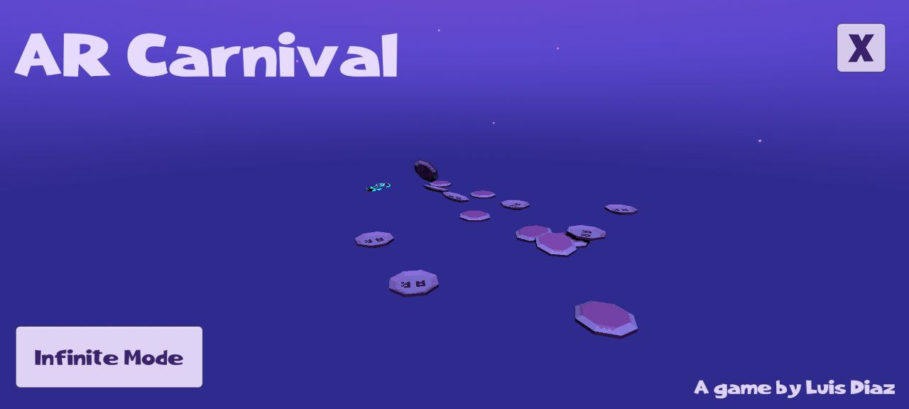

# ARCarnival

   

A simple AR game made with Unity and [Vuforia](https://developer.vuforia.com/#)! Plates spawn on a table, shoot at them with your toy gun to earn points!

This game was an experiment for my AR class where I tried to recreate an old arcade-style game with weird input peripherals. The AR gun is the weird input in this case. To achieve this, my janky experiment consisted of attaching a small marker to a ruler to use as the gun, and a big marker to a table to mark the spawn point of plates.

One of the hardest parts was encoding user input in an AR experience since you don't have easy access to buttons, specially holding a ruler-gun in one hand and your phone in the other. In this case, the inputs are shooting the gun and reloading it. For this I focused on simple gestures that can be easily checked with tracking states: You shoot by keeping the gun in the screen, and you can reload by taking it off the screen for a moment. To aim, you use the gun orientation and sight line to point at plates.

The 3D models were also made by myself with [blockbench](https://www.blockbench.net). I recently discovered this 3D modeling app and used this opportunity to learn 3D modeling with a simple program. It was a lot of fun! 

# Samples 

Full gameplay (Click to watch in YouTube):

